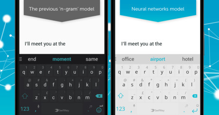

Next Word Prediction
========================================================
author: Luis Terán

## App: <https://luisteran.shinyapps.io/NextWordPredictor/>

  

image from: <https://vinaire.me/2020/07/30/key-word-clearing/>

Predictive Text Model
========================================================

Predictive texting is a data processed tool that makes it quicker and easier to write text by suggesting words as you type. Because the user simply taps on a word instead of typing it out on the keyboard, predictive text can significantly speed up the input process.

  

image from: <https://www.xatakandroid.com/aplicaciones-android/swiftkey-keyboard-comienza-a-usar-las-redes-neuronales-para-ofrecer-predicciones-mas-precisas>

Summary of the processing made
========================================================

- Data collection: The original data was provided by the Swiftkey dataset from: <https://d396qusza40orc.cloudfront.net/dsscapstone/dataset/Coursera-SwiftKey.zip>

- Data sampling: There original dataset is over 500Mb with more than 100 milion that makes the processing too slow. For that reason, and for equipment speed reasons, the data was randomly sampled to obtain a 20% of the original dataset size.

- Corpus processing: A corpus was created from the sampled data. From the corpus were removed numbers, punctuation, special characters, non appropriate words and leading and trailing whitespace. Also, every string element was transformed to lower case.

Summary of the processing made
========================================================

- N-Gram Models: N-Gram models were created. This means that the most frequent "n" consecutive words are looked for in the corpus and these are stated as the best options. Then, when the text is evaluated the last "n-1" words are collected. These words are anaylzed and the best coincidences are returned with the "n" word from the model. N-gram models were created for "n = 1,2,3,4,5". 

- Final N-Gram Models: There is a trade off between speed and precision of the models, for speeding up the action of response, only the best 10% options of every model was used for the app deployment.

App Deployment
========================================================

The models obtained before were integrated into a web app in Shiny. The app contains a central text input area and the best three suggestions are shown below. 

The app will read the text inside the text input area and predict the three most suitable options. After the prediction is made, the options are displayed as buttons. The user can press the button to insert text, the tool is intended to simulate text word predictor in smartphones. This three word prediction is made for every change in the input area.

App available in:
<https://luisteran.shinyapps.io/NextWordPredictor/>

Thank you!

